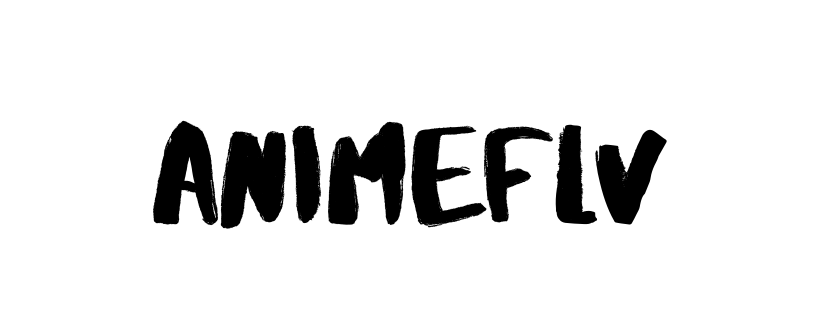

# **:triangular_flag_on_post: ANIMEFLV** (version 1.0.5)


          <a href="https://github.com/ChrisMichaelPerezSantiago/animeflv/graphs/commit-activity">
            
          </a>
          <a href="https://github.com/ChrisMichaelPerezSantiago/animeflv/blob/master/LICENSE">
            
          </a>
          
          
          
          [](https://travis-ci.com/ChrisMichaelPerezSantiago/animeflv)
          
          
         


 <a href="https://nodei.co/npm/animeflv/"></a>


> Animeflv is a custom API that has the entire catalog of the animeflv.net website. You can enjoy all the content with subtitles in Spanish and the latest in the world of anime for free.

---



## *Please, do not download version v1.0.0 from npm, I had made the mistake of leaving the parameters in the functions with predefined values.* ️️️️❗️️️

## :tada: Updates in version v1.0.5 :tada:
- [x] [v1.0.5](https://www.npmjs.com/package/animeflv/v/1.0.5) *npm package publish.*
- [x] `getAnimeInfo([id] , [title])` *function implemented.*
- [x] `downloadLinksByEpsId([epsId])` function implemented.


## ⚠️ Goodbye Message |  It remains in effect on 5/9/2020 ⚠️

Hello Partners,

Unfortunately I will be giving up on maintaining the library as I accept a job offer and I will start working this week and time will not allow me to do the maintenance.

I understand that this news for many who use this library would be somewhat sad, but as I said, I have no choice. For me now the most important thing and my focus would be on the job.

I very much appreciate those who supported the API, but this is not the end. For those who still want to continue using the API, I recommend that as soon as possible you fork the repo and locally maintain it, since I will stop maintaining it as soon as I start working this week.

If you have any questions about the code and how to begin to understand it, you can let me know, and I will help you. So that you can continue to maintain it without problem.

I hope you understand!

## 📖 API Documentation
The documentation in general has been removed from the `README.md` but has been migrated to a link. 
From now you can access all the API documentation from the following url [docs](https://animeflv-docs.now.sh/)


## :rocket: Custom Animeflv API Link
Link to access the [Animeflv API](https://animeflv.chrismichael.now.sh/api/v1/)

##  **Animeflv GraphQL**
For those developers who want to choose to use the API by consulting with GraphQL I leave an alternative [animeflv-gql](https://github.com/ChrisMichaelPerezSantiago/animeflv-gql)


## 📚 **Development Diary**
Describe the purpose of the project and give clues about what the code does. 
For more information go to the following link [Diary Reference](./development_diary/README.md).


##  **Donations**
Animeflv is an open source project licensed by MIT with continuous development. If you want me to continue maintaining this library and you are interested in continuing to use it, you can help me with a monetary help in the following link:


- [One-time donation via PayPal.](https://paypal.me/chrismperezsantiago?locale.x=en_US)

These are projects that take a lot of effort and time to maintain. So with your help I will be more motivated to continue maintaining the animeflv project. :)


## **:wrench: Developer usage**

### **Set up project**

Before cloning the repo **be sure** you have installed:

- [**NODE**](https://www.google.com/search?q=how+to+install+node) (version >= 10.16.x)
- [**NPM**](https://www.google.com/search?q=how+to+install+npm) (version >= 6.9.x)

Then:

- Choose a folder project in your system and switch in `cd [folder path]`
- Clone the repo in your folder path `git clone https://github.com/ChrisMichaelPerezSantiago/animeflv.git`

---

### **Installation**

In order to install the project and all dependencies, enter in the project folder and run `npm install`

---

### Start the project

```bash
npm start
```

### Test the project

```bash
npm test
```

---


## **:handshake: Contributing**

- Fork it!
- Create your feature branch: `git checkout -b my-new-feature`
- Commit your changes: `git commit -am 'Add some feature'`
- Push to the branch: `git push origin my-new-feature`
- Submit a pull request

---

### **:busts_in_silhouette: Credits**

- [Chris Michael](https://github.com/ChrisMichaelPerezSantiago) (Project Leader, and Developer)

---

### **:anger: Troubleshootings**

This is just a personal project created for study / demonstration purpose and to simplify my working life, it may or may
not be a good fit for your project(s).

---

### **:heart: Show your support**

Please :star: this repository if you like it or this project helped you!\
Feel free to open issues or submit pull-requests to help me improving my work.


---

### **📚 Projects that use the API**

<table>
  <tr>
    <td align="center">
      <a href="https://aruppi.github.io/">
        <br />
          <sub>
            <b>Aruppi</b>
          </sub>
      </a><br/>
        <sub>Anime y Manga</sub>
      </a>
    </td>
  </tr>
</table>


### **:robot: Author**

_*Chris Michael*_

> You can follow me on
[github](https://github.com/ChrisMichaelPerezSantiago)&nbsp;&middot;&nbsp;[twitter](https://twitter.com/Chris5855M)

---

Copyright © 2020 [Chris Michael](http://personal-porfolio.chrismichael.now.sh).
